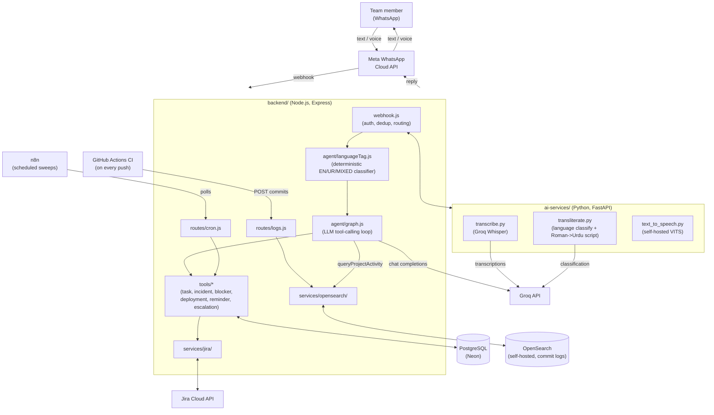
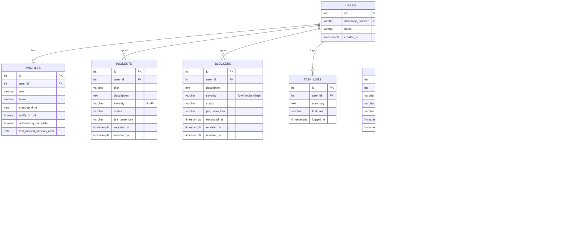
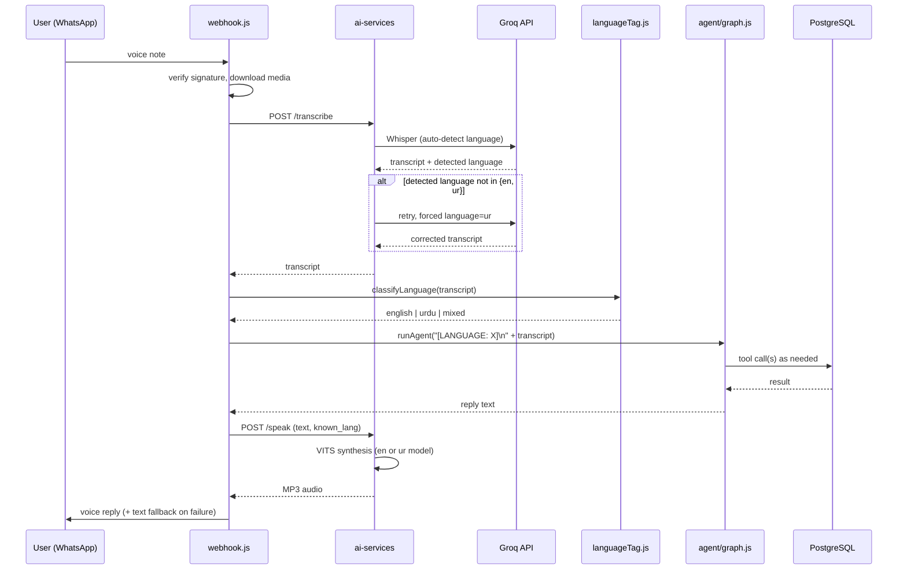
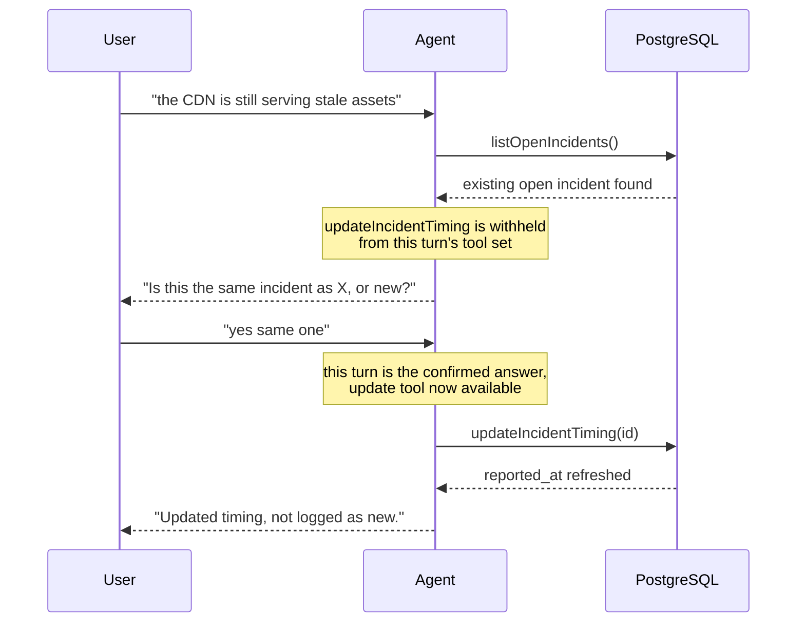
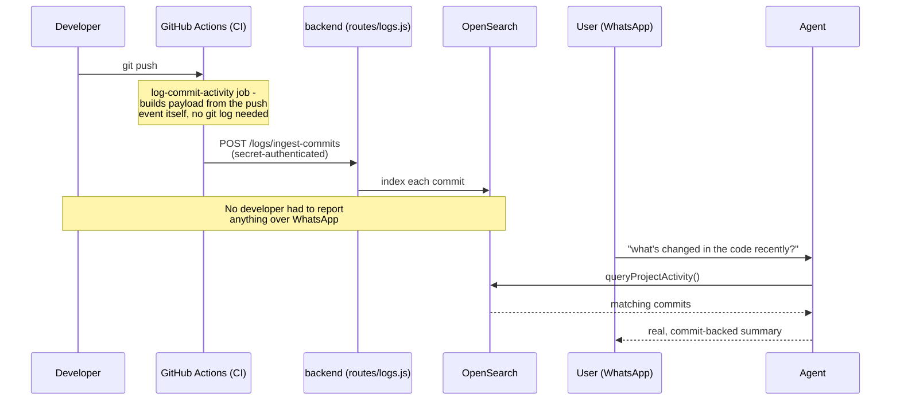
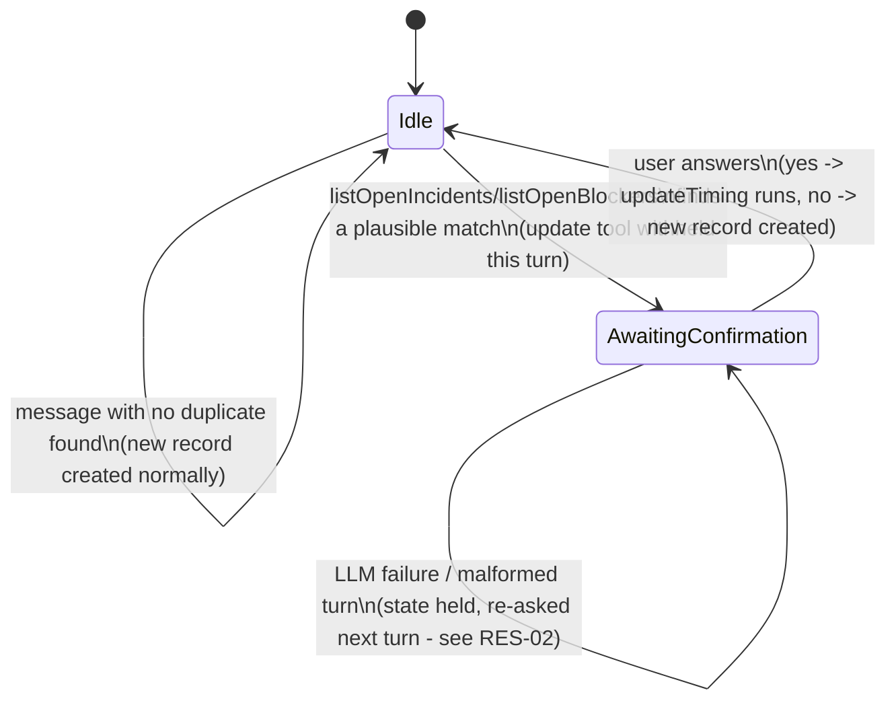
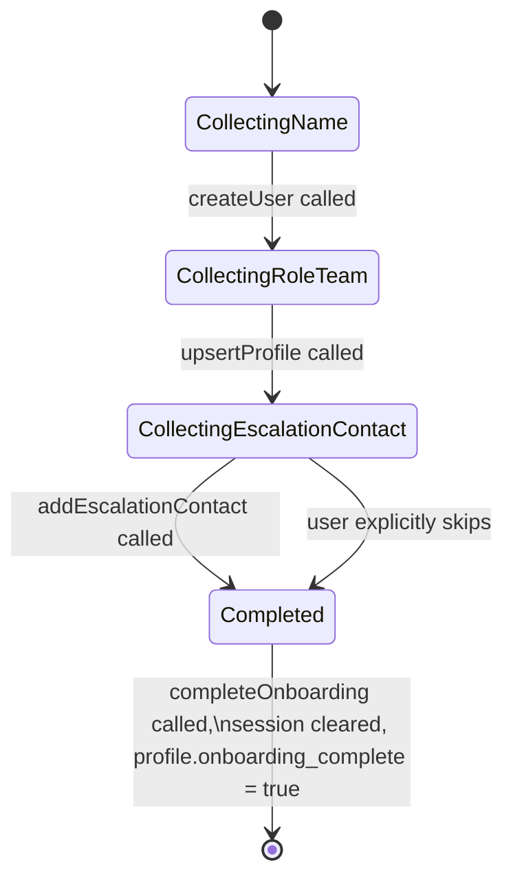
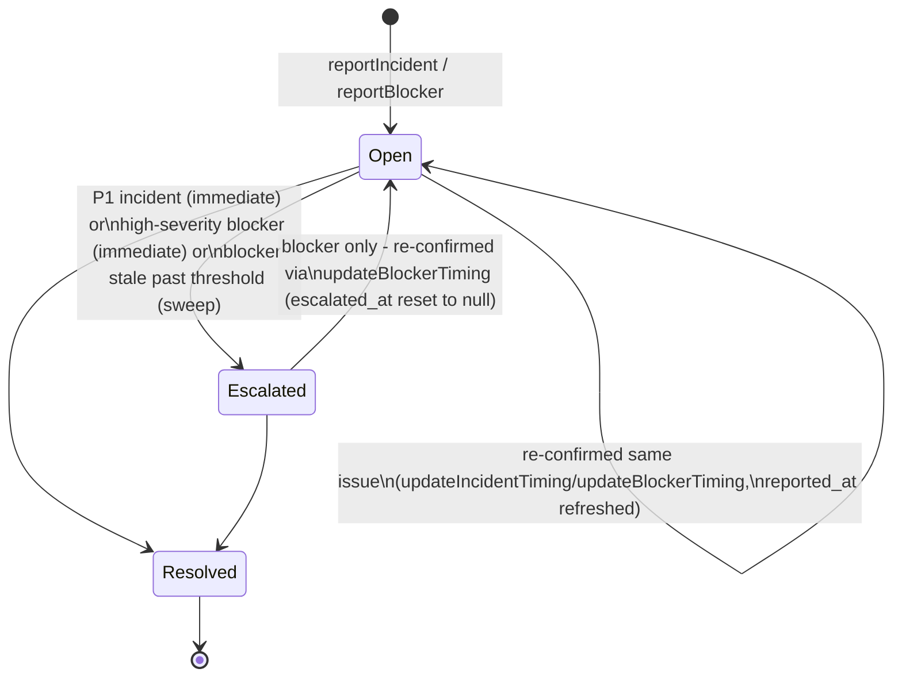

# Software Design Specification (SDS)
## DevPulse: Agentic WhatsApp Assistant for Engineering Team Operations

---

## 1. Architectural Design

DevPulse follows a layered, service-oriented architecture: a Node.js
backend owns conversation flow, business logic, and persistence; a
Python microservice owns AI/ML-specific work (speech-to-text,
text-to-speech, language classification); external services (WhatsApp,
Groq, Jira, n8n) are integrated at well-defined boundaries.

## 2. Component Design

### 2.1 Webhook layer (`webhook.js`)
Responsibilities: HMAC-SHA256 signature verification on inbound
requests, message deduplication (Meta redelivers on timeout, tracked
by message ID), routing text vs. voice messages, and orchestrating the
reply (text or synthesized voice) back to the user.

### 2.2 Language tagging (`languageTag.js`)
A deterministic, rule-based classifier (no LLM call) that inspects a
voice transcript for Urdu-script Unicode characters and a curated list
of Roman Urdu function words, producing one of `english` / `urdu` /
`mixed`. The classification is prepended to the message as a machine
-readable tag (`[LANGUAGE: URDU]`) before it reaches the agent, so
reply-language selection does not depend on the LLM re-inferring
language from a potentially noisy transcript. This design choice was
made after observing that LLM-based language inference was
non-deterministic even at temperature 0.

### 2.3 Agent core (`graph.js`)
A bounded multi-round tool-calling loop: on each round, the agent LLM
either calls one or more tools (executed against the tools layer, with
results fed back to the model) or produces a final natural-language
reply. Rounds are capped to guarantee termination. A per-user state
machine gates two specific tools (`updateIncidentTiming`,
`updateBlockerTiming`) so they can only be invoked in direct response to
a user's confirmation of a duplicate-report prompt from a prior turn,
preventing the write from happening silently before the user has
actually answered.

### 2.4 Tools layer (`tools/*.js`)
Discrete, single-responsibility functions the agent can invoke, each
mapping to one or more database operations: `taskLogTool`,
`incidentTool`, `blockerTool`, `deploymentTool`, `reminderTool`,
`escalationRuleTool`, `historyTool`, `historyPdfTool`, `blockerPdfTool`,
`profileTool`, `missedCheckinTool`, `notificationTool`.

### 2.5 AI microservice (`ai-services/`)
A separate Python/FastAPI process, isolated from the Node backend so
its ML dependencies (transformers, torch, pydub) don't entangle with the
Node runtime. Exposes `/transcribe` (STT) and `/speak` (TTS) over HTTP.

### 2.6 Scheduling (n8n + `routes/cron.js`)
Three n8n workflows poll dedicated, secret-authenticated backend
endpoints on a schedule (every 5 min for reminders, hourly for
missed-checkins, every 6 hours for stale-blocker escalation). Each
underlying check carries its own de-dup guard (a `sent`/`escalated_at`/
`last_missed_checkin_alert` flag) so re-running the sweep before the
condition changes is a safe no-op rather than a repeat notification.

### 2.7 Jira integration (`services/jira/jiraClient.js`)
A thin REST client wrapping Jira Cloud API v3's issue-creation endpoint.
Called as a best-effort side effect from `reportIncident`/
`reportBlocker`, wrapped in try/catch so DevPulse's own record is never
blocked by Jira being unreachable or misconfigured.

### 2.8 Automatic project-activity logging (`routes/logs.js`, `services/opensearch/`, `tools/projectActivityTool.js`)
Added per advisor feedback that activity logging shouldn't depend only
on a developer manually reporting it over WhatsApp - the system should
also be able to inspect the project's own codebase directly. On every
push, a GitHub Actions job (`log-commit-activity`) builds a commit-log
payload from the push event itself (no git history access needed in the
runner) and POSTs it to `/logs/ingest-commits`, a secret-authenticated
endpoint mirroring the `/cron/*` pattern. Commits are indexed into a
self-hosted OpenSearch instance. The agent can then read this back via
the `queryProjectActivity` tool, e.g. answering "what's changed in the
codebase recently?" from real commit data rather than anything logged
by a person.

## 3. Data Design (Entity-Relationship Diagram)

## 4. Sequence Diagrams: Key Flows

### 4.1 Voice message pipeline

### 4.2 Duplicate incident/blocker detection

### 4.3 Automatic commit-activity logging

## 5. State Diagrams

### 5.1 Duplicate-confirmation gate (per user, `graph.js`)

The `pendingDupConfirmation` map tracks, per user, whether the previous
turn ended on an unanswered "is this the same one?" question. This gates
which turn is allowed to call `updateIncidentTiming` /
`updateBlockerTiming`, the write can only happen on the turn that
actually answers the question, never the turn that asks it (a real bug
found via live testing: the write used to fire a turn early).

### 5.2 Onboarding session (per phone number, `agent/onboarding.js`)

An in-memory session (keyed by phone number) walks an unrecognized
WhatsApp number through registration before it ever reaches the main
agent. The escalation-contact step is explicitly skippable, and its
wording adapts to the user's own stated role (fixed after live testing
showed it wrongly assumed everyone has a "team lead" above them).

### 5.3 Incident / blocker lifecycle

Blockers carry an `escalated_at` guard that incidents don't need
(incidents don't currently re-escalate after their initial P1 trigger).
Re-confirming an already-escalated blocker as still-open resets that
guard, making it eligible to escalate again after another full
threshold period rather than being permanently skipped.

## 6. Interface Design

| Endpoint | Method | Purpose | Auth |
|---|---|---|---|
| `/webhook/whatsapp` | GET | Meta webhook verification | Verify token (query param) |
| `/webhook/whatsapp` | POST | Inbound message delivery | HMAC-SHA256 signature |
| `/cron/reminders` | POST | Reminder sweep (n8n) | Shared secret header |
| `/cron/missed-checkins` | POST | Missed-checkin sweep (n8n) | Shared secret header |
| `/cron/stale-blockers` | POST | Stale-blocker escalation (n8n) | Shared secret header |
| `/logs/ingest-commits` | POST | Commit-log ingestion (CI, on every push) | Shared secret header |
| `/health` | GET | Liveness check | None |
| `ai-services:/transcribe` | POST | Voice-to-text | Internal network only |
| `ai-services:/speak` | POST | Text-to-voice | Internal network only |

## 7. Design Decisions and Rationale

| Decision | Rationale |
|---|---|
| Deterministic language tagging instead of LLM-only inference | LLM language inference proved non-deterministic even at temperature 0; a rule-based classifier gives a stable signal the agent can trust |
| Bounded multi-round tool loop instead of single-round | Some operations (duplicate check → confirmed update) require sequential tool calls within reasonable turns; a single-round design either silently under-executes or, if unconstrained, can execute a write before the user confirms |
| Best-effort, non-blocking Jira integration | Jira must never become a hard dependency for DevPulse's own record-keeping |
| Commit activity logged automatically via CI, not by a developer | Advisor feedback: activity logging shouldn't depend solely on a person remembering to report it - having CI inspect and log real commits on every push removes that dependency entirely |
| OpenSearch instead of Elasticsearch for the log store | Same query/dashboard experience, but actually open-source (Apache 2.0) - Elasticsearch itself moved to a source-available license in 2021, which matters for an honestly-labeled "open source" claim in this documentation |
| Self-hosted TTS, hosted STT/LLM | A local LLM was evaluated for a sub-task and measured too slow (~2.4 tok/s) on available hardware; STT/agent reasoning remain on Groq's hosted, higher-throughput API, while the smaller VITS TTS models run locally at acceptable cost |
| Escalation messages built from a human-readable summary, not raw internal ids | Found via live testing: the original message format (`Escalation triggered (P1_incident) for user 11...`) exposed internal ids to a real recipient with no context, and could arrive interleaved into an unrelated WhatsApp conversation that person was having with the bot. `evaluateEscalation` now takes an explicit `summary` string from the caller and includes the reporter's name, instead of formatting from ids alone. |
| Immediate blocker escalation wired at the call site, not left to the sweep | `maybeEscalateBlocker` existed but was never actually invoked from `reportBlocker` - found via checking real database state during live testing, not assumed from the function's existence. High-severity blockers now escalate immediately, matching the same pattern `reportIncident` already used for P1. |
